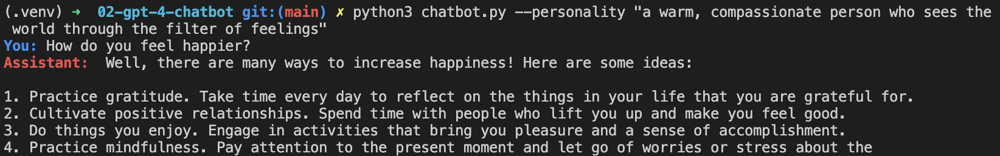

# GPT-4 Chatbot

A simple command line chatbot with ChatGPT-4.

<p align="center">
    
</p>

## Setup

You need to create a virtual env and install the packages listed in `requirements.txt`. You can then run Jupyter Notebooks in VS Code.

Follow these steps: [How to Work with Python Virtual Environments, Jupyter Notebooks and VS Code](https://python.plainenglish.io/how-to-work-with-python-virtual-environments-jupyter-notebooks-and-vs-code-536fac3d93a1).

## Usage

To run the CLI:

```
cd 02-gpt-4-chatbot
python3 chatbot.py
```

You can define the personality of your chatbot, it is friendly and helpful by default:

```
python3 chatbot.py --personality "funny"
```

You can quit by typing `ctrl + C` (Mac) or `cmd + C` (Windows).

## Features

- writing the basic chatbot structure.
- persisting messages accross requests.
- adding optional personalities.
- colorizing the chatbot output.

Based on [Mastering OpenAI Python APIs: Unleash the Power of GPT4](https://www.udemy.com/course/mastering-openai/) by Colt Steele (2023).
