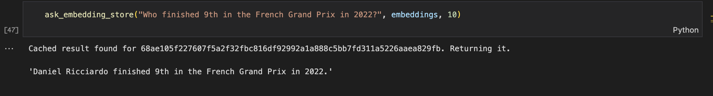

# Q&A Bot

A dynamic Q&A Bot using GPT-4.

    

## Setup

You need to create a virtual env and install the packages listed in `requirements.txt`. You can then run Jupyter Notebooks in VS Code.

Follow these steps: [How to Work with Python Virtual Environments, Jupyter Notebooks and VS Code](https://python.plainenglish.io/how-to-work-with-python-virtual-environments-jupyter-notebooks-and-vs-code-536fac3d93a1).

You need to create a `.env` file with your `OPENAI_API_KEY`.

# Usage

Open `F1_QA_Assistant.ipynb`.

## Features

- scraping data from Wikipedia.
- generating a bunch of embeddings on the last Formula One season.
- turning the questions from users into embeddings.
- finding the K nearest neighbors to that embedding.
- including the matching texts in the prompt to expand GPT-4 knowledge.

Based on [Mastering OpenAI Python APIs: Unleash the Power of GPT4](https://www.udemy.com/course/mastering-openai/) by Colt Steele (2023).
