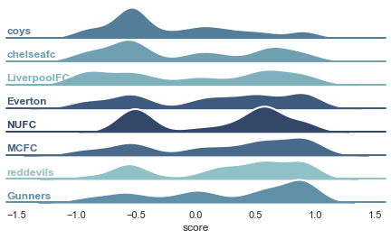

# Sentiment Analysis Project

A tool to analyze the sentiment of Reddit comments using GPT-4.

    

## Setup

You need to create a virtual env and install the packages listed in `requirements.txt`. You can then run Jupyter Notebooks in VS Code.

Follow these steps: [How to Work with Python Virtual Environments, Jupyter Notebooks and VS Code](https://python.plainenglish.io/how-to-work-with-python-virtual-environments-jupyter-notebooks-and-vs-code-536fac3d93a1).

You need to create a `.env` file with your `OPENAI_API_KEY`, `REDDIT_CLIENT_ID`, and `REDDIT_CLIENT_SECRET`.

For Reddit API credentials, you need to [create a personal use script](https://www.reddit.com/prefs/apps).

# Usage

Open `Reddit Sentiment Analysis.ipynb`.

## Features

- collecting comments from Reddit.
- analyzing sentiment in the comments.
- plotting the results.

Based on [Mastering OpenAI Python APIs: Unleash the Power of GPT4](https://www.udemy.com/course/mastering-openai/) by Colt Steele (2023).
