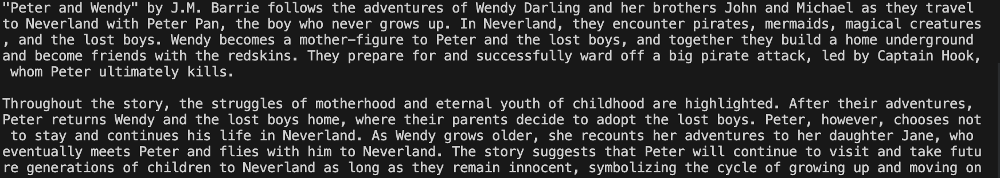

# Book Summarizer Project

A tool to summarize books of any size into a couple of paragraphs.

<p align="center">
    
</p>

## Setup

You need to create a virtual env and install the packages listed in `requirements.txt`. You can then run Jupyter Notebooks in VS Code.

Follow these steps: [How to Work with Python Virtual Environments, Jupyter Notebooks and VS Code](https://python.plainenglish.io/how-to-work-with-python-virtual-environments-jupyter-notebooks-and-vs-code-536fac3d93a1).

You need to create a `.env` file with your `OPENAI_API_KEY`.

# Usage

To run the script:

```
cd 08-book-summarizer-project
python3 summarize.py
```

## Features

- preparing book text for summarization.
- handling context window math to respect the max tokens limit.
- adding summarization logic using recursion.
- caching results with hashing keys.
- performing a "meta-summary" with GPT-4.

Based on [Mastering OpenAI Python APIs: Unleash the Power of GPT4](https://www.udemy.com/course/mastering-openai/) by Colt Steele (2023).
