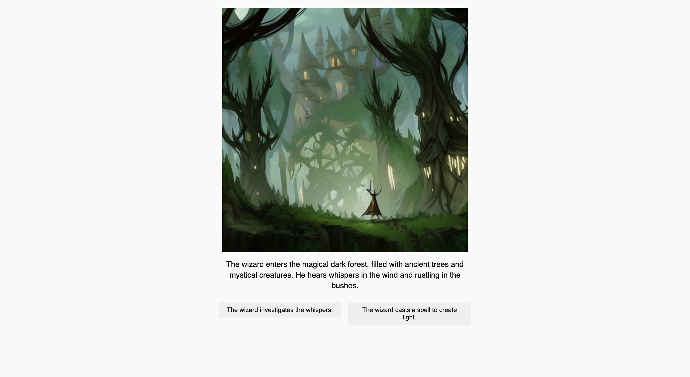

# Choose Your Own Adventure App

A gamebook app with Stable Diffusion and GPT-4.

<!-- <p align="center">
    
</p> -->

## Setup

You need to create a virtual env and install the packages listed in `requirements.txt`. You can then run Jupyter Notebooks in VS Code.

Follow these steps: [How to Work with Python Virtual Environments, Jupyter Notebooks and VS Code](https://python.plainenglish.io/how-to-work-with-python-virtual-environments-jupyter-notebooks-and-vs-code-536fac3d93a1).

You need to create a `.env` file with your `OPENAI_API_KEY`.

For Stable Diffusion, you need to add your `STABILITY_AI_KEY`. You can find it in your [DreamStudio account](https://dreamstudio.ai/account) once it's created.

## Usage

<!-- To run the app:

```
cd 02-gpt-4-chatbot
python3 chatbot.py
``` -->

## Features

- generating text with GPT-4.
- generating images with Stable Diffusion.

Based on [Mastering OpenAI Python APIs: Unleash the Power of GPT4](https://www.udemy.com/course/mastering-openai/) by Colt Steele (2023).
