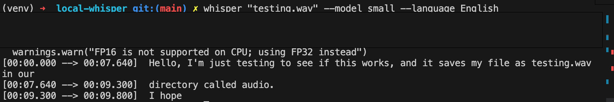

# Whisper Transcription Tool

A tool to convert spoken audio into accurate transcriptions and translations, using Whisper.

<p align="center">
    
</p>

## Setup

You need to create a virtual env and install the packages listed in `requirements.txt`. You can then run Jupyter Notebooks in VS Code.

Follow these steps: [How to Work with Python Virtual Environments, Jupyter Notebooks and VS Code](https://python.plainenglish.io/how-to-work-with-python-virtual-environments-jupyter-notebooks-and-vs-code-536fac3d93a1).

You need to create a `.env` file with your `OPENAI_API_KEY`.

For the CLI, we followed [these steps](https://blog.deepgram.com/how-to-run-openai-whisper-in-command-line/).

## Usage

# Basics

Open `Whisper Basics.ipynb`.

# CLI

To run the CLI:

```
cd 10-whisper-transcription-tool/local-whisper
python3 -m venv venv
source venv/bin/activate
pip3 install
```

You will need `ffmpeg`.

Then, you can run:

```
whisper "testing.wav" --model small --language English
```

## Features

- providing a prompt to Whisper.
- translating audio with Whisper.
- transcribing non-English audio.
- running the Whisper model locally.
- running Whisper in the command line.

Based on [Mastering OpenAI Python APIs: Unleash the Power of GPT4](https://www.udemy.com/course/mastering-openai/) by Colt Steele (2023).
