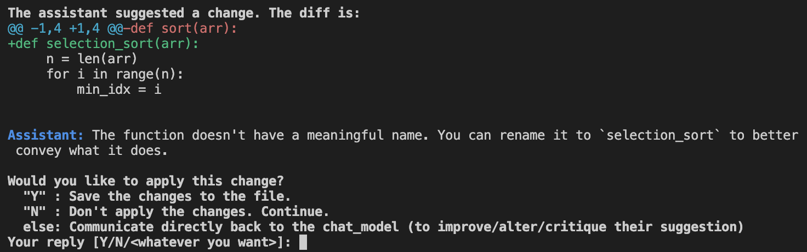

# OpenAI Projects

Some projects using OpenAI APIs with Python.

## Setup

You need to create a virtual env and install the packages listed in `requirements.txt`. You can then run Jupyter Notebooks in VS Code.

Follow these steps: [How to Work with Python Virtual Environments, Jupyter Notebooks and VS Code](https://python.plainenglish.io/how-to-work-with-python-virtual-environments-jupyter-notebooks-and-vs-code-536fac3d93a1).

## Color Palette Generator

A visual tool to generate color palettes using OpenAI Completion API with Python.

[Check the 01-color-palette-generator folder](01-color-palette-generator)

    

### Features

- writing the color palette generator prompt.
- writing a color-swatch rendering function.
- setting up the Flask server.
- integrating OpenAI with server.
- writing the palette endpoint.
- creating the form.
- rendering the colors in the browser.
- styling the color blocks and the form.
- refactoring our front-end code.

## GPT-4 Chatbot

A simple command line chatbot with ChatGPT-4.

[Check the 02-gpt-4-chatbot folder](02-gpt-4-chatbot)

    

### Features

- writing the basic chatbot structure.
- persisting messages accross requests.
- adding optional personalities.
- colorizing the chatbot output.

## Automatic code reviewer

A simple command-line-based code reviewer.

[Check the 03-automatic-code-reviewer folder](03-automatic-code-reviewer)

<!-- 

    

 -->

### Features

- building a basic code reviewer.
- adding an interactive code reviewer.

## Playground

[Check the playground](playground/) to understand the basics.

Based on [Mastering OpenAI Python APIs: Unleash the Power of GPT4](https://www.udemy.com/course/mastering-openai/) by Colt Steele (2023).
